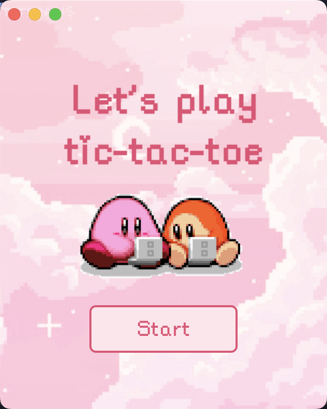
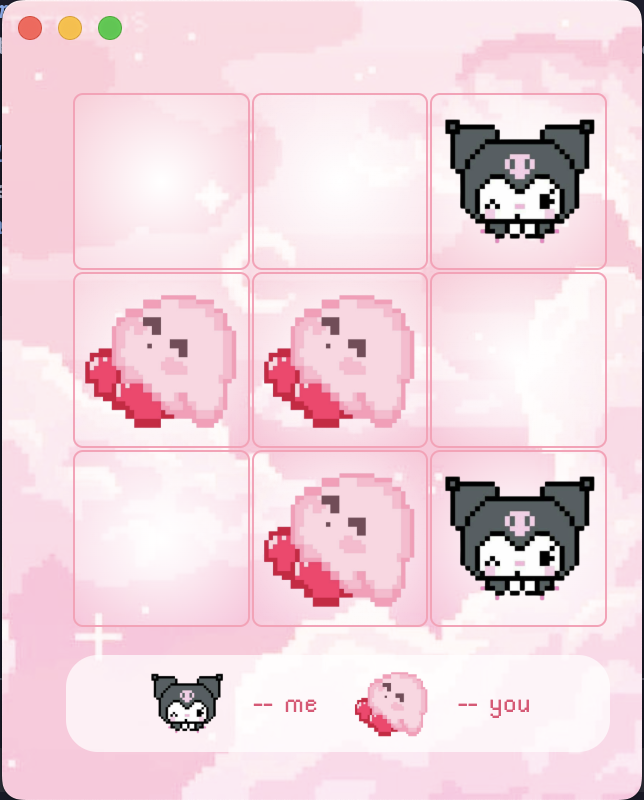
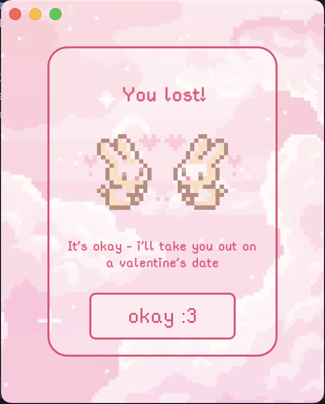

# valentine-tictactoe

Taking inspiration from a TikTok video, I decided to recreate the game in React for fun.

Here are some of the screenshots of the game:

<table border="0" style="border-collapse: collapse; border: none;">
  <tr>
    <td style="border: none; padding: 0 10px;"></td>
    <td style="border: none; padding: 0 10px;"></td>
    <td style="border: none; padding: 0 10px;"></td>
  </tr>
</table>

## Prerequisites

Before you begin, ensure you have met the following requirements:
* Node.js (version 14.x or higher)
* npm (usually comes with Node.js)

## Installation

To install this project, follow these steps:
1. Clone the repository
`git clone https://github.com/clarissachng/valentine-tictactoe.git`

2. Install dependencies
`npm install`

3. Start the development server
`npm start`

## Development

To run the project in development mode:
`npm run dev`

## Building

To build the application: `npm run build`

## Usage

To use this project, you can start the development server by running `npm start`

## Scripts

- `npm start` - Starts the application
- `npm run dev` - Runs the app in development mode
- `npm run build` - Builds the app for production